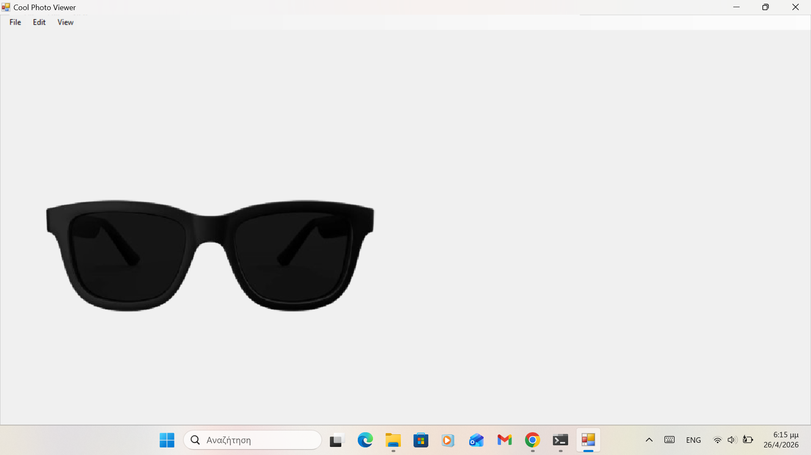

# Cool Photo Viewer

A lightweight photo viewer written in C# (.NET Framework 4.8) with support for standard image formats and custom **TXI/TXIA** files.



---

## ✨ Features

* Supports: **JPG / JPEG / JFIF, PNG, BMP, TXI, TXIA**
* Built-in TXI/TXIA renderer and exporter
* 🆕 **Mouse wheel zoom support**
* 🆕 **Auto-centered image rendering**
* Zoom in / zoom out controls
* Built-in file operations:

  * Open images
  * Save As (including TXI / TXIA export)

---

## 🛠️ TXI / TXIA Format Support

* `!TXI` / `TXI!` → RGB format
* `!TXIA` / `TXIA!` → RGBA format (with alpha support)
* Human-readable pixel-based format
* Fully supported for loading and saving inside the viewer

---

## 🧰 External Editing Support

Open images directly in external tools:

* MS Paint (standard images)
* Photos app (standard images)
* Notepad (TXI/TXIA)
* Visual Studio Code (TXI/TXIA)

---

## 🚀 Improvements in v1.1

* Added **TXI/TXIA export functionality**
* Improved **TXI/TXIA parsing and validation**
* Added **mouse wheel zoom**
* Image now **renders centered in the window**
* Better zoom limits and stability improvements

---

## ▶️ How to Run

Go to the **Releases** section and download the latest version.

---

## 🛠️ How to Compile

### Requirements

* .NET Framework 4.8
* `csc` (C# compiler)

### Steps

```cmd
csc /target:winexe /out:CoolPhotoViewer.exe CoolPhotoViewer.cs
```

---
